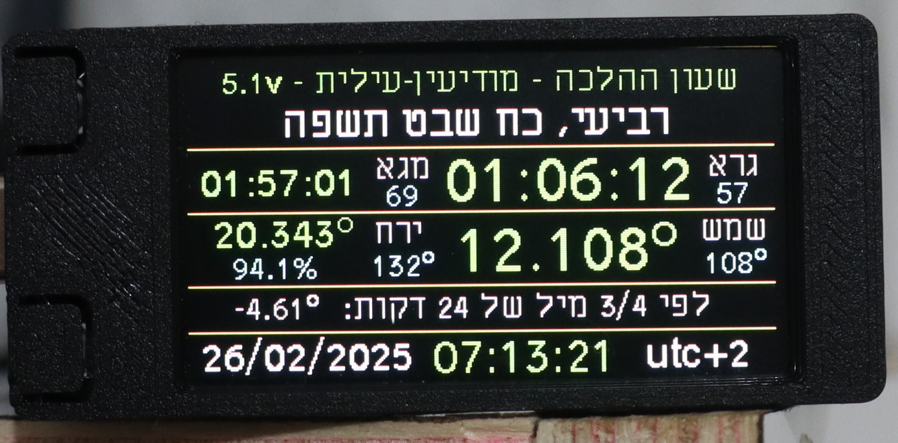

# Halacha-watch-T-DISPLAY-S3



## License  
**The file `main_shemesh_s3` is for personal use only!**  
**Modification is strictly prohibited.** You may use it as-is, but you may not edit, modify, or alter its content.  
**Commercial use is forbidden.** If you wish to use `main_shemesh_s3` for business or organizational purposes, please contact the author.  

Other files in this repository may have different licensing terms.

I would especially like to mention and thank the following important things that are freely licensed and I use them:
1. https://github.com/russhughes/s3lcd/blob/main/firmware/GENERIC_S3_OCT_16M/firmware.bin
2. https://github.com/peterhinch/micropython-samples/tree/d2929df1b4556e71fcfd7d83afd9cf3ffd98fdac/astronomy

## hardware

The hardware needed is:
This microcontroller:
https://lilygo.cc/products/t-display-s3?variant=42284559827125
solder 5 pins to it for an RTC clock called: **DS3231 MINI**
G+NC+16+21+17 (next to each other)
(DS3231 MINI can be purchased separately on AliExpress and includes a backup battery for the clock)

Attention! To prevent the DS3231 backup battery from draining quickly, it is very important to remove the 2 PULL_UP resistors located on the back of the main board and responsible for pins 16 and 17 according to the instructions here. They must be carefully removed with a soldering iron.

https://github.com/Xinyuan-LilyGO/T-Display-S3/issues/313


## INSTALL

First install (using Tony) the file:
https://github.com/sgbmzm/Halacha-T-S3/blob/main/rom/firmware_t_display_s3_s3lcd.bin
or directly from here:
https://github.com/russhughes/s3lcd/blob/main/firmware/GENERIC_S3_OCT_16M/firmware.bin

Then connect to WIFI and install the necessary files using the following code:


```
import network
import time

# פרטי הרשת שלך
SSID = "SSID_NAME" # Enter your network name (as string).
PASSWORD = "123456789" # Enter your network password (as string).

def connect_wifi():
    wlan = network.WLAN(network.STA_IF)  # מצב תחנת WiFi
    wlan.active(True)  # הפעלת WiFi
    if not wlan.isconnected():
        print("מתחבר לרשת WiFi...")
        wlan.connect(SSID, PASSWORD)  # חיבור לרשת
        while not wlan.isconnected():
            time.sleep(1)  # המתן לחיבור
    print("מחובר ל-WiFi בהצלחה!")
    print("כתובת IP:", wlan.ifconfig()[0])  # הצגת כתובת IP

# קריאה לפונקציה
connect_wifi()


import mip
mip.install("github:sgbmzm/Halacha-T-S3/package.json",target="/")
```

